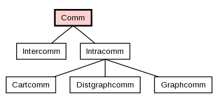

.. _introMPI:

===================
Introduction to MPI
===================

Hello World
-----------
As tradition has it, we will introduce you to MPI programming using a variation on the standard hello world program: your first MPI python program will be the Hello World program for multiple processes. The source code is as follows::

	#hello.py
	from mpi4py import MPI
	comm = MPI.COMM_WORLD
	rank = comm.Get_rank()
	print "hello world from process ", rank

After saving this text as *hello.py*, it is executed using the following command-line syntax, run from the file's directory::

	$ mpiexec  -n 5 python  hello.py
	
The above command will execute five python processes which can all communicate with each other. When each program runs, it will print hello, and tell you its rank::

	hello world from process 0
	hello world from process 1
	hello world from process 3
	hello world from process 2
	hello world from process 4

Notice that when you try this on your own, they do not necessarily print in order. This is because 5 separate processes are running on different processors, and we cannot know beforehand which one will execute its print statement first. If the processes are being scheduled on the same processor instead of multiple processors, then it is up to the operating system to schedule the processes, and it has no preference of any one of our processes over any other process of ours. In essence, each process executes autonomously.

.. warning::

	It is usually bad practice to perform I/O (e.g., call ``print``) from any process besides the root process, though it can oftentimes be a useful tool for debugging (for more information see the chapter :ref:`IOandDebugging`). We do it here, however, for pedagogical purposes.

Execution
---------

As mentioned in the section An Overview of Parallel Computing, *mpi4py* programs are single-program multiple-data programs, and therefore each process will run the same code a bit differently. When we execute the command below, a number of things happen.::

	$ mpiexec  -n 5 python  hello.py

First, the mpiexec program is launched. This is the program which starts MPI, a wrapper around whatever program you to pass into it. The ``-n 5`` option specifies the desired number of processes. In our case, 5 processes are run, each one being an instance of python. To each of the 5 instances of python, we pass the argument ``hello.py`` which is the name of our program's text file, located in the current directory. Each of the five instances of python then opens the *.py* file and runs the same program. The difference in each process's execution environment is that the processes are given different ranks in the communicator. Because of this, each process prints a different number when it executes.

MPI and python combine to make wonderfully succinct source code. The second line of the above program (the first line is a comment) makes available the MPI module from the mpi4py package. Using the ``.`` operator we can access a static communicator object, of which the current process can learn about its rank. 

This program introduces us to the root *mpi4py* class, *Comm*, which stands for Communicator. ``MPI.COMM_WORLD`` is a static reference to a *Comm* object, and ``comm`` is just a reference to it for our convenience. We could have omitted line three, and simply used ``MPI.COMM_WORLD`` in place of ``comm`` and the program would have behaved identically. A "communicator" represents a system of computers or processors which can communicate with each other via MPI commands. *Comm* objects have many methods and properties, shown in the appendix, :ref:`commMethods`. Read over this section to get a high-level understanding of the bulk of MPI. Not all of the methods in the Comm object correlate to the MPI specification, but most of them do.

The Communicator
----------------

A communicator is a logical unit that defines which processes are allowed to send and receive messages. By organizing processes this way, MPI can physically rearrange which processes are assigned to which CPUs, and optimize your program for speed.

Intracommunicators and Intercommunicators
^^^^^^^^^^^^^^^^^^^^^^^^^^^^^^^^^^^^^^^^^

Intracommunicators are the most commonly used form of communicator in MPI. Each intracommunicator contains a set of processes, each of which is identified by its "rank" within the communicator. The ranks are numbered 0 through ``Size-1``. Any process in the communicator can send a message to another process within the communicator or receive a message from any other process in the communicator. Intracommunicators also support a variety of collective operations that involve all of the processes in the communicator. Most MPI communication occurs within intracommunicators. Intercommunicators provide a sophisticated method of implementing complex communications, but very few MPI programs require them.

The hierarchy of communicators is shown in the figure below :ref:`commHier`. In this document we will focus on intracommunicator communication. 

.. _commHier:

	The Hierarchy of Communicators
	
Finding Out About the Rest of the World
---------------------------------------

In *mpi4py*, ranks are essential to learning about other processes. A rank is the process's id within a communicator. A process can be part of more than one communicator at any given time. When ``Comm.Get_rank()`` is called in your program, it gets called by every process in the communicator variable ``comm``, and the rank of each respective process is stored into the variable pointed to by rank. Remember, rank points to a local variable, which is unique for every calling process because each process has its own separate copy of local variables.

``Get_Rank``, when used with ``Get_Size``, forms the central method for finding out about other processes. ``Comm.Get_Size`` returns the number of processors in the communicator. Using these two subroutines, a process can learn where it stands in its communicator and who else is out there. All it needs to know to communicate with another process is that other process's rank, which ranges from 0 to ``comm.size - 1`` excluding the process's own rank.

Get_size() and Get_rank()
-------------------------

.. function:: Comm.Get_size()

   Returns the number of processes in the communicator. It will return the same number to every process.

   :param Comm: communicator we wish to query
   :type Comm: MPI comm
   :rvalue: number of processes in the communicator
   :rtype: integer

Example::

	from mpi4py import MPI
	size = MPI.COMM_WORLD.Get_size()

	
.. function:: Comm.Get_rank()

	Determines the rank of the calling process in the communicator.
	
	:param Comm: communicator we wish to query
	:type Comm: MPI comm
	:rvalue: rank of the calling process in the communicator
	:rtype: integer
	

Example::

	from mpi4py import MPI
	rank = MPI.COMM_WORLD.Get_rank()

.. note::

	Note that one of the main differences between this presentation of mpi4py and MPI in C or Fortan, besides being array-based, is that mpi4py is largely object oriented. The MPI Communicator in mpi4py is a Python class and MPI functions like *Get_size()* or *Get_rank()* are instance methods of the communicator class. Throughout the tutorial you will see functions like ``Get_rank()`` are presented as ``Comm.Get_rank()`` where it is implied that ``Comm`` is an instance of the *Comm* class. I will document ``Comm`` as in input parameter to the function.

Seperate Codes in One File
--------------------------
When an MPI program is run, each process receives the same code. However, each process is assigned a different rank. This allows us to embed a seperate code for each process into one file. In the following code, all processes are given the same two numbers. However, though there is only one file, 3 processes are given completely different instructions for what to do with them. Process 0 sums them, process 1 multiplies them, and process 2 takes the maximum of them::

	#seperateCodes.py
	from mpi4py import MPI
	rank = MPI.COMM_WORLD.Get_rank()
	
	a = 6.0
	b = 3.0
	if rank == 0:
		print a + b
	if rank == 1:
		print a * b
	if rank == 2:
		print max(a,b)
	
	
Exercises
---------
1. Write the "Hello World" program from above so that every process prints out its rank and the size of the communicator (for example, process 3 on a communicator of size 5 prints "Hello World from process 3 out of 5!").
2. Write a program in which the the processes with even rank print "Hello" and process with odd rank print "Goodbye." Print the process number along with the "Hello" or "Goodbye" (for example, "Goodbye from process 3").
3. Sometimes the program you write can only run correctly if it has a certain number of processes. Although you typically want to avoid writing these kinds of programs, sometimes it is inconvenient or unavoidable. Write a program that runs only if it has 5 processes. Upon failure, the root node should print "Error: This program must run with 5 processes" and upon success it should print "Success!" To exit, call the function ``Comm.Abort()``.